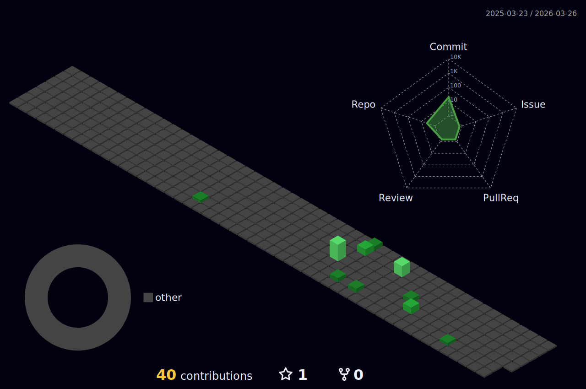

<h2> Hi, I'm Rahn Grey! </h2>

<!--
**Rahn-grey/Rahn-grey** is a ✨ _special_ ✨ repository because its `README.md` (this file) appears on your GitHub profile.

Here are some ideas to get you started:

- 🔭 I’m currently working on ...
- 🌱 I’m currently learning ...
- 👯 I’m looking to collaborate on ...
- 🤔 I’m looking for help with ...
- 💬 Ask me about ...
- 📫 How to reach me: ...
- 😄 Pronouns: ...
- ⚡ Fun fact: ...
-->

###  about me...  
```python
from ctf import pwn, misc
from code import cpp, c, python, rust
from os import freebsd, linux, windows
from network import huawei, cisco
from languages​ import chinses, jp

this = {
    "Running" : ["DS", "English", "CN", "CO", "OS"],
}
```


